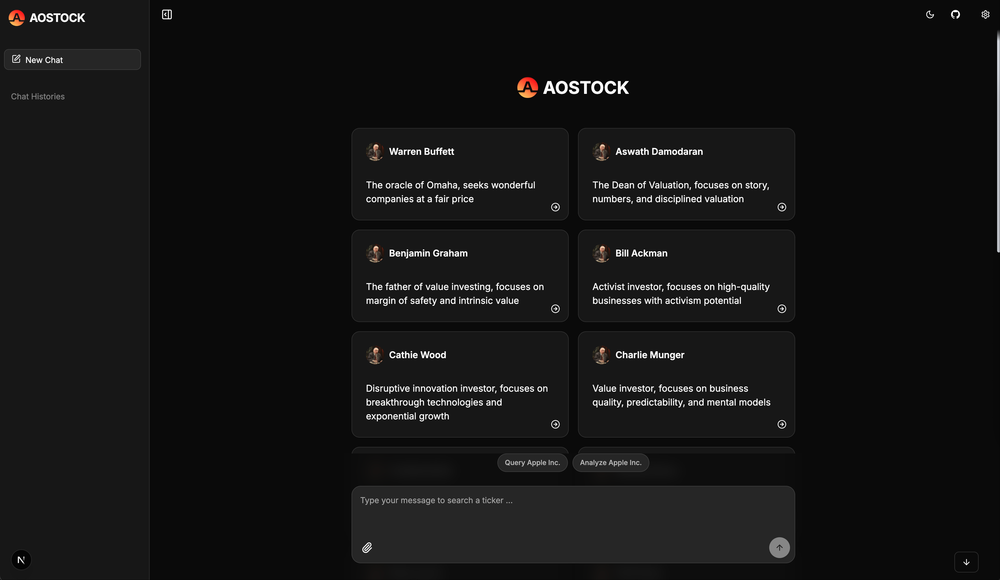

# AOSTOCK Agent Chat UI

This project is a fork of [Agent Chat UI](https://github.com/langchain-ai/agent-chat-ui) by LangChain. It has been customized for AOSTOCK's financial analysis and trading assistant applications.

AOSTOCK Agent Chat UI is a Next.js application that provides a chat interface for interacting with LangGraph-based AI agents. It's specifically configured to work with AOSTOCK's financial analysis services and trading assistants.



## Key Features

- **Financial Data Integration**: Pre-configured to connect to AOSTOCK's financial data APIs
- **Specialized Assistants**: Custom AI assistants for financial analysis, trading, and investment research
- **Enhanced UI Components**: Tailored interface for displaying financial data, charts, and analysis results
- **Multi-Model Support**: Configurable intent recognition and analysis models

## Setup

First, clone the repository:

```bash
git clone https://github.com/aostock/agent-chat-ui
cd agent-chat-ui
```

Install dependencies:

```bash
pnpm install
```

Run the app:

```bash
pnpm dev
```

The app will be available at `http://localhost:3000`.

## Configuration

The application comes pre-configured with AOSTOCK's default settings:

- **Server API URL**: `https://agent.aostock.com`
- **Assistant ID**: `agent`
- **Financial Data API**: `https://data.aostock.com`

You can override these settings through the UI or by setting environment variables:

```bash
NEXT_PUBLIC_API_URL=https://agent.aostock.com
NEXT_PUBLIC_ASSISTANT_ID=agent
```

## Custom Assistants

This application includes several specialized financial assistants:

- **Portfolio Manager**: For portfolio analysis and optimization
- **Risk Manager**: For risk assessment and management
- **Trading Assistant**: For trading strategy execution
- **Valuation Expert**: For company valuation and analysis
- **Technical Analyst**: For technical analysis of market data
- **Fundamental Analyst**: For fundamental analysis of stocks
- **Sentiment Analyzer**: For market sentiment analysis

Each assistant is represented by a custom icon and is optimized for specific financial tasks.

## Development

### Available Scripts

- `pnpm dev` - Start development server
- `pnpm build` - Build for production
- `pnpm start` - Start production server
- `pnpm lint` - Run ESLint
- `pnpm lint:fix` - Run ESLint and fix issues
- `pnpm format` - Format code with Prettier
- `pnpm format:check` - Check code formatting

### Project Structure

- `src/app/` - Next.js app directory
- `src/components/` - React components
- `src/providers/` - React context providers
- `src/hooks/` - Custom React hooks
- `src/lib/` - Utility functions
- `public/images/assistants/` - Custom assistant icons

## Production Deployment

To deploy to production:

1. Update the environment variables in your deployment platform:

   ```bash
   NEXT_PUBLIC_API_URL=https://agent.aostock.com
   NEXT_PUBLIC_ASSISTANT_ID=agent
   ```

2. Build and deploy the application:
   ```bash
   pnpm build
   ```

## Customization

### Adding New Assistants

To add new assistants:

1. Add a new icon to `public/images/assistants/`
2. Update the assistant configuration in the settings
3. Configure the corresponding backend LangGraph agent

### Model Configuration

The application supports configuring different models for:

- **Intent Recognition**: For understanding user queries
- **Analysis**: For deep financial analysis

These can be configured in the settings dialog or through environment variables.

## Learn More

This project is based on the [Agent Chat UI](https://github.com/langchain-ai/agent-chat-ui) by LangChain, which provides a foundation for building chat interfaces for LangGraph applications.

For more information on LangGraph and LangChain, check out the [LangChain documentation](https://docs.langchain.com/docs/).
